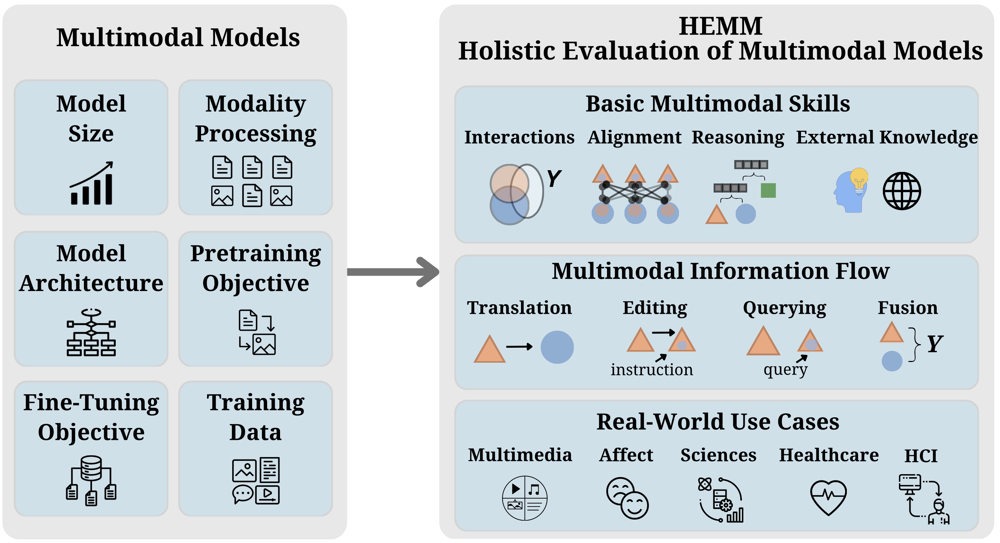
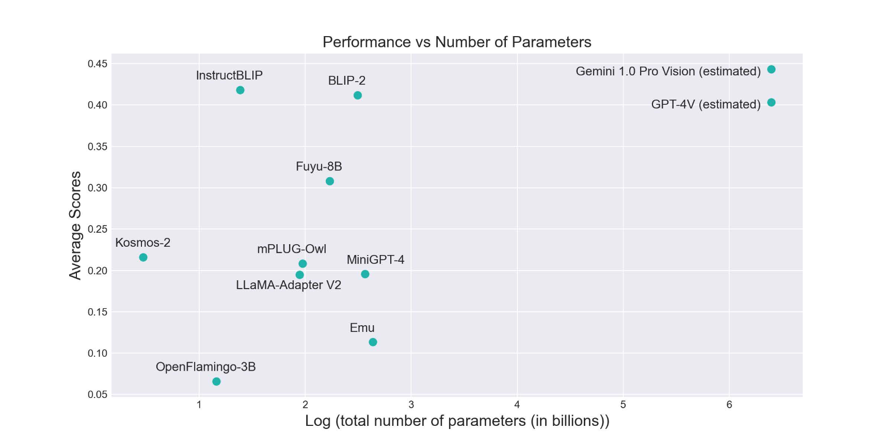

# HEMM

## Overview 



Multimodal foundation models that can holistically process text alongside images, video, audio, and other sensory modalities are increasingly used in a variety of real-world domains. However, it is challenging to characterize and study progress in multimodal foundation models, given the range of possible modeling decisions, tasks, and domains. In this work, we introduce Holistic Evaluation of Multimodal Models (HEMM) as a framework to systematically evaluate the capabilities of multimodal foundation models across a set of 3 comprehensive dimensions: basic skills, information flow, and real-world use cases. *Basic multimodal skills* are internal abilities required to solve problems, such as learning interactions across modalities, fine-grained alignment, multi-step reasoning, and the ability to handle external knowledge. *Information flow* studies how multimodal content changes during a task through querying, translation, editing, and fusion. *Use cases* span domain-specific challenges introduced in real-world multimedia, affective computing, natural sciences, healthcare, and human-computer interaction applications.


Overall, HEMM's collection of 29 datasets enables a systematic evaluation of today's multimodal foundation models. Through comprehensive experiments of many models across HEMM tasks, we (1) identify key *dataset dimensions* (e.g., basic skills, information flows, and use cases) that pose challenges to today's models, and (2) distill performance trends regarding how different *modeling dimensions* (e.g., scale, pre-training data, multimodal alignment, pre-training, and instruction tuning objectives) influence downstream task performance. These findings yield important conclusions regarding challenging multimodal interactions, use cases, and tasks requiring reasoning and external knowledge, the benefits of data and model scale, and the benefits of instruction-tuning.

## Datasets Currently Supported
HEMM currently supports the following datasets

1. Multimedia: VQA, Visual Genome, VCR, OK-VQA, GQA, NoCaps, Flickr30k, Winoground, NLVR, NLVR2, IRFL, MM-IMDb, Magic Brush 
2. Affective Computing: NewYorker Cartoon, Hateful Memes, MemeCap, Memotion, FER-2013
3. Science: ScienceQA, Resisc-45, UCMERCED LAND USE, iNaturalist, DECIMER 
4. Healthcare: PathVQA, VQARAD, OpenPath, SlakeVQA
5. HCI: Enrico, Screen2Words

Follow these steps to add a new dataset:

1. Go to ./hemm/prompts/
2. Add a file containing the code to return the prompt for the task 
3. Go to ./hemm/data/
4. Add the dataset file containing the class (inherited from hemm.data.dataset.HEMMDatasetEvaluator) to load the dataset. Make sure to have the load, get_prompt, evaluate_dataset, and evaluate_dataset_batched methods. The load method should download the dataset files, get_prompt method should return the suitable prompt based on the inputs, evaluate_dataset method evaluates the input model on individual inputs without batching, and evaluate_dataset_batched method perfoms the batched inference (only if the model supports batched inference).  
5. Import the dataset file in ./hemm/utils/base_utils/ and add the suitable dataset key in the "load_dataset_evaluator" function.
6. Check whether the dataset loads correctly. Finally, evaluate the loaded model on the dataset.

## Models Currently Supported


HEMM currenlty supports the following open source Multimodal Foundation Models

1. BLIP-2 (key: blip2)
2. InstructBLIP (key: instruct_blip)
3. mPLUG-Owl (key: mplugowl)
4. Kosmos-2 (key: kosmos2)
5. OpenFlamingo-3B (key: openflamingo)
6. Fuyu-8B (key: fuyu)
7. MiniGPT-4 (key: minigpt4)
8. Emu (key: emu)
9. LLaMA-Adapter V2 (key: llama_adapter)


Create a virtual environment and install dependencies.

```
python -m venv env
source env/bin/activate
pip install -r requirements.txt
cd HEMM
```

Note: We use some datasets from Huggingface and Kaggle. Make sure to get your api key from the following [link](https://huggingface.co/docs/hub/en/security-tokens) and [link](https://github.com/Kaggle/kaggle-api).
Provide the path of the directory where kaggle.json is stored in the ```load_dataset_evaluator```

Sample code:

```python
from hemm.utils.base_utils import load_model, load_dataset_evaluator, load_metric

model_key = 'minigpt4'
model = load_model(model_key)
model.load_weights()

dataset_name = 'hateful_memes'
dataset_evaluator = load_dataset_evaluator(dataset_name, kaggle_api_directory='./')

metric_name = 'accuracy'
metric = load_metric(metric_name)

## For single data point evaluation
results = dataset_evaluator.evaluate_dataset(model=model, metric=metric)
print(results)

## For batching evaluation
results = dataset_evaluator.evaluate_dataset_batched(model=model, metric=metric, batch_size=32)
print(results)
```


---------------------------------------------------------------------------


Following models and datasets are supported -> 

Models
```
blip2
minigpt4
```

Datasets
```
hateful_memes
newyorkercartoon
memecaps
memotion
nocaps
irfl
scienceqa
vqa
vcr
gqa
okvqa
vqarad
resisc45
ucmerced
pathvqa
face_emotion
```

To evaluate these datasets, metrics are specified in the ```hemm.metrics``` directory
For ```memecaps``` and ```nocaps``` dataset, ```bleu_score``` or ```bertscore``` metric is used. All QA datasets use ```bertscore``` metric. Rest of the other datasets use ```accuracy``` metric. 


-----------------------------------------------------------------------------------------

To add new datasets, metrics and models, base class is provided in each of the modules ```hemm/models/model.py```, ```hemm/metrics/metric.py``` and ```hemm/data/dataset.py``` Inheriting these abstract classess will allow the user to contribute to HEMM.
