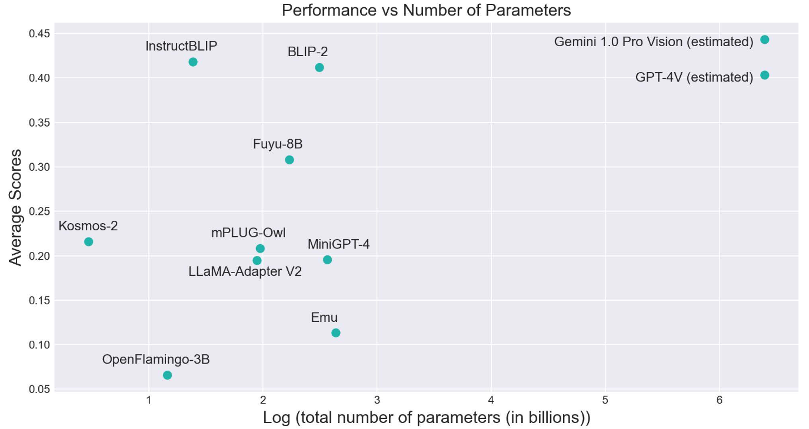
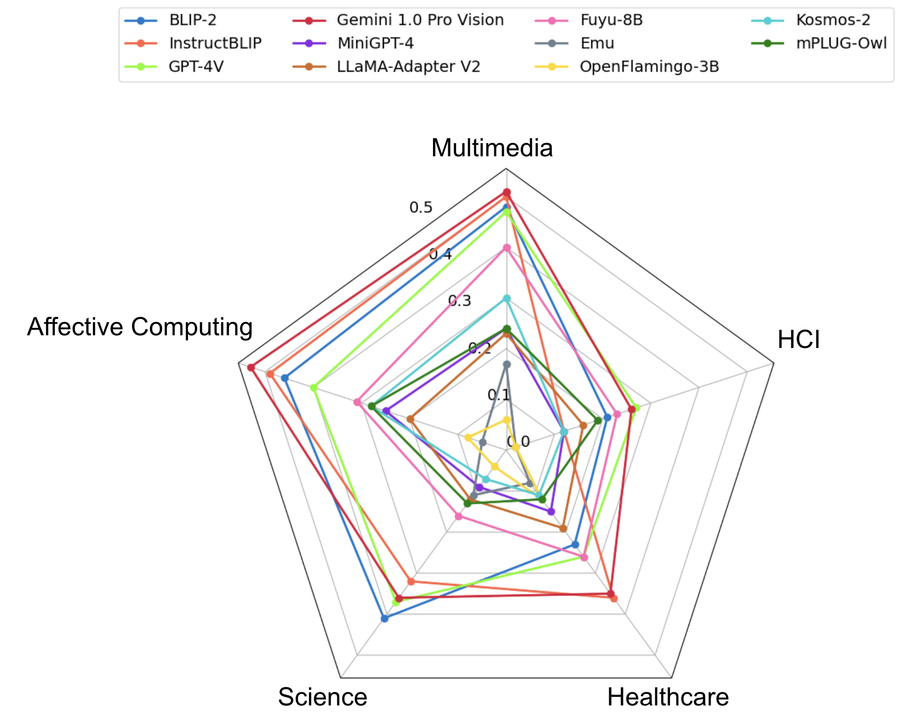

# HEMM

## Overview

<div align="center">
    
</div>

[**HEMM: Holistic Evaluation of Multimodal Foundation Models**](https://arxiv.org/abs/2407.03418)<br>
Paul Pu Liang, Akshay Goindani, Talha Chafekar, Leena Mathur, Haofei Yu, Ruslan Salakhutdinov, Louis-Philippe Morency<br>

Multimodal foundation models that can holistically process text alongside images, video, audio, and other sensory modalities are increasingly used in a variety of real-world domains. However, it is challenging to characterize and study progress in multimodal foundation models, given the range of possible modeling decisions, tasks, and domains. In this work, we introduce Holistic Evaluation of Multimodal Models (HEMM) as a framework to systematically evaluate the capabilities of multimodal foundation models across a set of 3 comprehensive dimensions: basic skills, information flow, and real-world use cases.

1. *Basic multimodal skills* are internal abilities required to solve problems, such as learning interactions across modalities, fine-grained alignment, multi-step reasoning, and the ability to handle external knowledge.

2. *Information flow* studies how multimodal content changes during a task through querying, translation, editing, and fusion.

3. *Use cases* span domain-specific challenges introduced in real-world multimedia, affective computing, natural sciences, healthcare, and human-computer interaction applications.

Overall, HEMM's collection of 30 datasets enables a systematic evaluation of today's multimodal foundation models. Through comprehensive experiments of many models across HEMM tasks, we (1) identify key *dataset dimensions* (e.g., basic skills, information flows, and use cases) that pose challenges to today's models, and (2) distill performance trends regarding how different *modeling dimensions* (e.g., scale, pre-training data, multimodal alignment, pre-training, and instruction tuning objectives) influence downstream task performance. These findings yield important conclusions regarding challenging multimodal interactions, use cases, and tasks requiring reasoning and external knowledge, the benefits of data and model scale, and the benefits of instruction-tuning.

If you find this repository useful, please cite the corresponding paper:
```
@article{liang2024hemm,
  title={HEMM: Holistic Evaluation of Multimodal Foundation Models},
  author={Liang, Paul Pu and Goindani, Akshay and Chafekar, Talha and Mathur, Leena and Yu, Haofei and Salakhutdinov, Ruslan and Morency, Louis-Philippe},
  journal={arXiv preprint arXiv:2407.03418},
  year={2024}
}
```

## Categorization 

### Dataset Categorization
We categorize the datasets based on individual dimensions such as Use Case, Multimodal Interaction, Granularity of Multimodal Alignment, Level of Reasoning, Cross-Modal Information Flow, and External Knowledge. Below are the categories for the dimensions

* Use Case: Multimedia, Affective Computing, Science, Healthcare, and HCI
* Cross-Modal Information Flow: Querying, Translation, and Fusion
* Granularity of Multimodal Alignment: Yes (Fine-Grained) and No (Not Fine-Grained)
* External Knowledge: Yes (External Knowledge needed) and No (External Knowledge not needed)
* Reasoning: Less and More
* Multimodal Interaction: Redundancy, Uniqueness, and Synergy

### Model Categorization
Modeling dimensions and categories are as follows:

* Modality Processing: Interleaved and Separate
* Model Size: Small, Medium, and Large
* Training Type: Modular Fine-tuning and End-to-End 
* Size of Training Data: Small, Medium and Large
* Instruction Tuning: Yes (Instruction tuned) and No (only Supervised fine-tuning)
* Diversity of Pretraining Data: Diverse and Non-Diverse

## Currently Supported Datasets
HEMM currently supports the following datasets

1. Multimedia: VQA, Visual Genome, VCR, OK-VQA, GQA, NoCaps, Flickr30k, Winoground, NLVR, NLVR2, IRFL, MM-IMDb, Magic Brush 
2. Affective Computing: NewYorker Cartoon, Hateful Memes, MemeCap, Memotion, FER-2013
3. Science: ScienceQA, Resisc-45, UCMERCED LAND USE, iNaturalist, DECIMER 
4. Healthcare: PathVQA, VQARAD, OpenPath, SlakeVQA
5. HCI: Enrico, Screen2Words

Follow these steps to add a new dataset:

1. Go to ./hemm/prompts/
2. Add a file containing the code to return the prompt for the task 
3. Go to ./hemm/data/
4. Add the dataset file containing the class (inherited from hemm.data.dataset.HEMMDatasetEvaluator) to load the dataset. Make sure to have the load, get_prompt, evaluate_dataset, and evaluate_dataset_batched methods. The load method should download the dataset files, get_prompt method should return the suitable prompt based on the inputs, evaluate_dataset method evaluates the input model on individual inputs without batching, and evaluate_dataset_batched method performs the batched inference (only if the model supports batched inference).  
5. Import the dataset file in ./hemm/utils/base_utils/ and add the suitable dataset key in the "load_dataset_evaluator" function.
6. Check whether the dataset loads correctly. Finally, evaluate the loaded model on the dataset.

## Currently Supported Models
<div align="center">
    
</div>

HEMM currently supports the following open-source Multimodal Foundation Models

1. BLIP-2 (key: blip2)
2. InstructBLIP (key: instruct_blip)
3. mPLUG-Owl (key: mplugowl)
4. Kosmos-2 (key: kosmos2)
5. OpenFlamingo-3B (key: openflamingo)
6. Fuyu-8B (key: fuyu)
7. MiniGPT-4 (key: minigpt4)
8. Emu (key: emu)
9. LLaMA-Adapter V2 (key: llama_adapter)

For our analysis, we also evaluate the closed models - GPT-4V and Gemini 1.0 Pro Vision. 

Follow these steps to add new models to HEMM:

1. Go to ./hemm/models/
2. Add the model file containing the code to load the model and generate the response. The model class can inherit from hemm.models.model.HEMMModel. The class should contain the methods - load_weight and generate for loading the pre-trained weights and running inference on a single image-text input. If the model supports batched inference, add the get_image_tensor and generate_batch methods for getting the image features from the model and running batched inference. 
3. Import the model file in ./hemm/utils/base_utils and add the suitable model key in the "load_model" function.
4. Check whether the new model is loaded and can be evaluated on the datasets.

## Evaluation

### Metrics

HEMM currently supports the following metrics for text generation tasks. Since BARTScore has the highest human correlation amongst these metrics, we use BARTScore for our analysis.

1. BARTScore
2. BERTScore
3. ROUGE
4. RefCLIP-S

For Image generation tasks, HEMM supports Mean Squared Error and CLIP-I score. 

### Protocol

We perform our analysis on text-generation tasks and compute the BARTScore(generation, ground truth) of the models on all the tasks. For each task, we then normalize the scores using min-max scaling, where min represents the score of the worst performing model and max corresponds to the identity score (BARTScore(ground truth, ground truth)).

### Results
<div align="center">
    
</div>


* Overall, Science, Healthcare, and HCI datasets are more challenging for the models as compared to Multimedia and Affective Computing, with iNaturalist (Species Classification), DECIMER, Enrico, PathVQA, and MemeCap being the most difficult tasks for the models. 
* Tasks requiring external knowledge are significantly harder than tasks not requiring external knowledge. We do not find a significant difference between the average scores on less reasoning and more reasoning datasets indicating that we need better datasets to test for complex reasoning. 
* On average, Large models perform significantly better than medium/small-sized models with significant improvements of up to 75%. Models with diverse pretraining data achieve higher scores than models pretrained only using standard image captioning datasets, showing improvements on tasks like iNaturalist and MemeCap which are knowledge-intensive and require complex reasoning.
* Instruction-tuned models significantly outperform models with only supervised fine-tuning and achieve better performance on cross-modal translation tasks (e.g., DECIMER, Screen2Words, MemeCap) by generating more accurate and detailed captions. However, some instruction-tuned models still struggle to follow instructions. Larger and more diverse instruction-tuning datasets can help alleviate this problem.   


## Usage 
Create a virtual environment and install dependencies.

```
python -m venv env
source env/bin/activate
pip install -r requirements.txt
cd HEMM
```

Note: We use some datasets from Huggingface and Kaggle. Make sure to get your api key from [Huggingface](https://huggingface.co/docs/hub/en/security-tokens) and [Kaggle](https://github.com/Kaggle/kaggle-api). Provide the Huggingface Authorization token (hf_auth_token) and the path (kaggle_api_path) of the directory where kaggle.json is stored in the ```load_dataset_evaluator```

Sample code:

```python
from hemm.utils.base_utils import load_model, load_dataset_evaluator
from hemm.metrics.bartscore_metric import BartScoreMetric

model_key = 'blip2'
model = load_model(model_key, download_dir="./")
model.load_weights()

dataset_name = 'hateful_memes'
dataset_evaluator = load_dataset_evaluator(dataset_name,
                                            download_dir="./",
                                            kaggle_api_path=kaggle_api_path,
                                            hf_auth_token=hf_auth_token,)

## For single data point evaluation
predictions, ground_truth = dataset_evaluator.evaluate_dataset(model=model)
metric = BartScoreMetric()
bart_score = metric.compute(predictions, ground_truth)

## For batching evaluation (if model supports batched inference)
results = dataset_evaluator.evaluate_dataset_batched(model=model, batch_size=32)
print(results)
```

## Leaderboard

coming soon!

