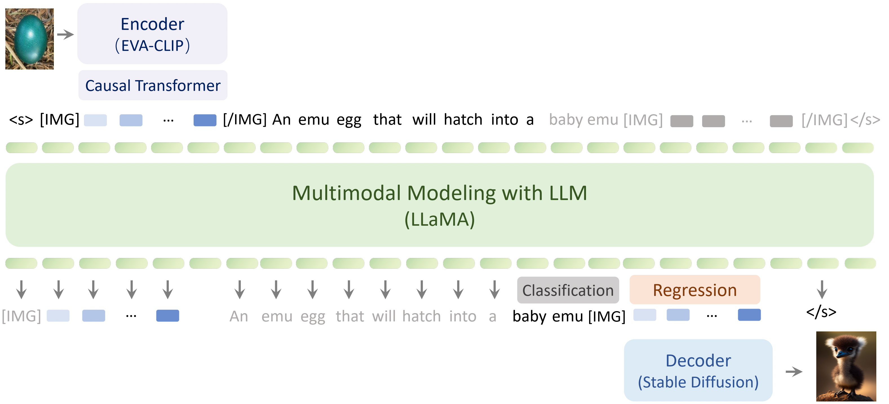
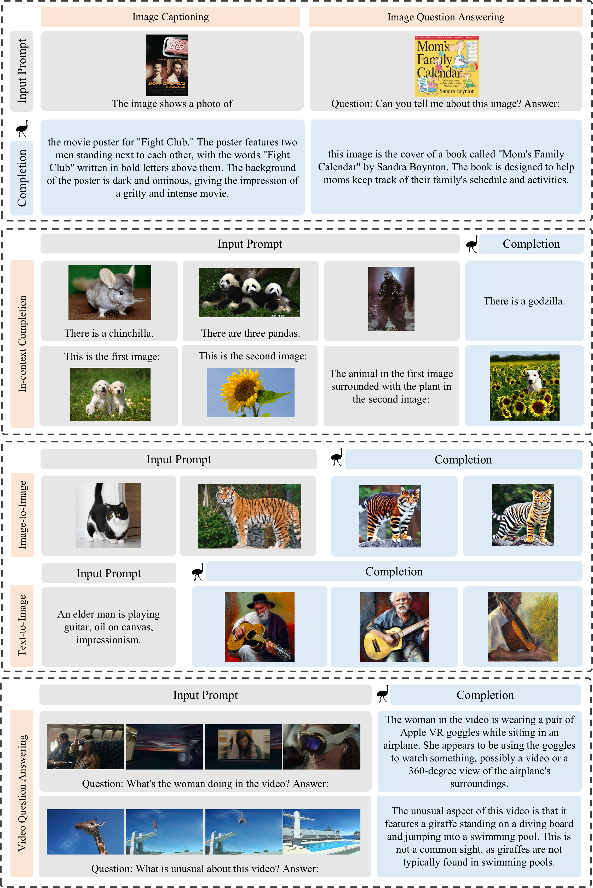

<div align='center'>
<h1>Emu: An Open Multimodal Generalist</h1h1>
<h3><a href="https://arxiv.org/abs/2307.05222">Generative Pretraining in Multimodality</a></h3>

[Quan Sun](https://github.com/Quan-Sun)<sup>1*</sup>, [Qiying Yu](https://yqy2001.github.io)<sup>2,1*</sup>, [Yufeng Cui]()<sup>1*</sup>, [Fan Zhang](https://scholar.google.com/citations?user=VsJ39HMAAAAJ)<sup>1*</sup>, [Xiaosong Zhang](https://github.com/zhangxiaosong18)<sup>1*</sup>, [Yueze Wang]()<sup>1</sup>, [Hongcheng Gao](https://hongcheng-gao.github.io/)<sup>1</sup>,<br>[Jingjing Liu](https://air.tsinghua.edu.cn/en/info/1046/1194.htm)<sup>2</sup>, [Tiejun Huang](https://scholar.google.com/citations?user=knvEK4AAAAAJ&hl=en)<sup>1,3</sup>, [Xinlong Wang](https://www.xloong.wang/)<sup>1</sup>
	
<sup>1</sup> [BAAI](https://www.baai.ac.cn/english.html), <sup>2</sup> [THU](https://air.tsinghua.edu.cn), <sup>3</sup> [PKU](https://english.pku.edu.cn/) <br><sup>*</sup> Equal Contribution

|  [Paper](https://arxiv.org/abs/2307.05222) | [Demo](https://emu.ssi.plus/) |

[](https://paperswithcode.com/sota/visual-question-answering-on-mm-vet?tag_filter=0)
</div>

**Emu is a multimodal generalist that can seamlessly generate images and texts in multimodal context**. **Emu** is trained with a unified autoregressive objective, *i.e.*, predict-the-next-element, including both visual embeddings and textual tokens. Trained under this objective, **Emu** can serve as a generalist interface for both image-to-text and text-to-image tasks.



## News

* `Oct 16, 2023`: **Emu-I** achieves [state-of-the-art performance](https://paperswithcode.com/sota/visual-question-answering-on-mm-vet?tag_filter=0) on the [MM-Vet](https://github.com/yuweihao/MM-Vet) benchmark (w/o external tools like GPT-4), which assesses large multimodal models in real-world, in-the-wild scenarios.
* `Oct 13, 2023`: The code for the zero-shot evaluation of **Emu-I** has been released!
* `Sep 18, 2023`: Tools for processing YT-Storyboard-1b dataset have been released!

## Generalist Interface

**Emu** serves as a generalist interface capable of diverse multimodal tasks, such as image captioning, image/video question answering, and text-to-image generation, together with new abilities like in-context text and image generation, and image blending:



## Setup

Clone this repository and install required packages:

```shell
git clone https://github.com/baaivision/Emu
cd Emu

pip install -r requirements.txt
```

## Model Weights

We release the pretrained and instruction-tuned weights of **Emu**. Our weights are subject to LLaMA-1's [license](https://github.com/facebookresearch/llama/blob/1076b9c51c77ad06e9d7ba8a4c6df775741732bd/LICENSE).

| Model name         | Weight                                                  |
| ------------------ | ------------------------------------------------------- |
| **Emu w/ Decoder** | [🤗 HF link](https://huggingface.co/BAAI/Emu/tree/main/pretrain) (34GB) |
| **Emu-I**          | [🤗 HF link](https://huggingface.co/BAAI/Emu/blob/main/Emu-instruct.pt) (27GB) |

## Inference

At present, we provide inference code that can process interleaved image-text and **video** as input, and output text and image.

For instruction-tuned model, we provide examples for image captioning, visual question answering, and interleaved multi-image understanding:

```sh
python inference.py --instruct --ckpt-path ${INSTRUCT_CKPT_PATH}
```

For pretrained model, we provide an example for in-context learning:

```sh
python inference.py --ckpt-path ${PRETRAIN_CKPT_DIR}/multimodal_encoder/pytorch_model.bin
```

For image generation, we provide examples for image blending, text-to-image and in-context generation:

```sh
python image_inference.py --ckpt-path ${PRETRAIN_CKPT_DIR}
```

## Evaluation

We provide **Emu-I**'s zero-shot evaluation code on MM-Vet, COCO Caption, VQAv2, OKVQA, VizWiz and VisDial benchmarks. For example, evaluating COCO captioning on a node with 8 GPUs:
```sh
python -m torch.distributed.launch \
    --nproc_per_node=8 \
    --use_env \
    eval.py \
    --instruct \
    --batch_size 4 \
    --ckpt_path ${INSTRUCT_CKPT_PATH} \
    --root_path /path/to/benchmark_root \
    --dataset_name coco \  # coco, mmvet, vqav2, okvqa, vizwiz, visdial
    --output_path ./output/
```
where `/path/to/benchmark_root` should contain the following file structure:
```
benchmark_root/
    mm-vet/
        mm-vet.json
        images/
            v1_0.png
            ...
    coco/
        images/
            test2015/
                COCO_test2015_{...}.jpg
                ...
            val2014/
                COCO_val2014_{...}.jpg
                ...
        annotations/
            coco_karpathy_test.json
            coco_karpathy_test_gt.json
            coco_karpathy_val.json
            coco_karpathy_val_gt.json
            v2_OpenEnded_mscoco_val2014_questions.json
            v2_mscoco_val2014_annotations.json
            vqa_test.json
            vqa_val_eval.json
    okvqa/
        annotations/
            OpenEnded_mscoco_val2014_questions.json
            mscoco_val2014_annotations.json
            vqa_val_eval.json
    vizwiz/
        images/
            test/
                VizWiz_test_{...}.jpg
                ...
            val/
                VizWiz_val_{...}.jpg
                ...
        annotations/
            test.json
            val.json
    visdial/
        VisualDialog_test2018/
            VisualDialog_test2018_{...}.jpg
            ...
        VisualDialog_val2018/
            VisualDialog_val2018_{...}.jpg
            ...
        visdial_1.0_test.json
        visdial_1.0_val.json
```
You can also customize your own file structure and modify the corresponding data loading code. Each dataset file can be found in the `mm_eval/datasets/` directory. All files can be downloaded from the official dataset websites or from [LAVIS](https://github.com/salesforce/LAVIS). 


## Schedule

We are committed to open-sourcing all Emu related materials, including:

- [x] The weights of **Emu** and **Emu-I**
- [x] Inference example for interleaved image-text as input, text as output
- [x] Video inference example
- [x] Weights of image decoder & image generation/blending example
- [x] YT-Storyboard-1B pretraining data
- [ ] Pretraining code
- [ ] Instruction tuning code
- [x] Evaluation code

We hope to foster the growth of our community through open-sourcing and promoting collaboration👬. Let's step towards multimodal intelligence together🍻.

## Acknowledgement

We thank the great work from [LLaMA](https://github.com/facebookresearch/llama), [BLIP-2](https://github.com/salesforce/LAVIS), [Stable Diffusion](https://github.com/CompVis/stable-diffusion), and [FastChat](https://github.com/lm-sys/FastChat).

## Citation

If you find Emu useful for your research and applications, please consider starring this repository and citing:

```
@article{Emu,
  title={Generative Pretraining in Multimodality},
  author={Sun, Quan and Yu, Qiying and Cui, Yufeng and Zhang, Fan and Zhang, Xiaosong and Wang, Yueze and Gao, Hongcheng and Liu, Jingjing and Huang, Tiejun and Wang, Xinlong},
  publisher={arXiv preprint arXiv:2307.05222},
  year={2023},
}
```

## Misc

<div align="center">

[](https://github.com/baaivision/Emu/stargazers)


[](https://github.com/baaivision/Emu/network/members)


[](https://star-history.com/#baaivision/Emu&Date)

</div>
